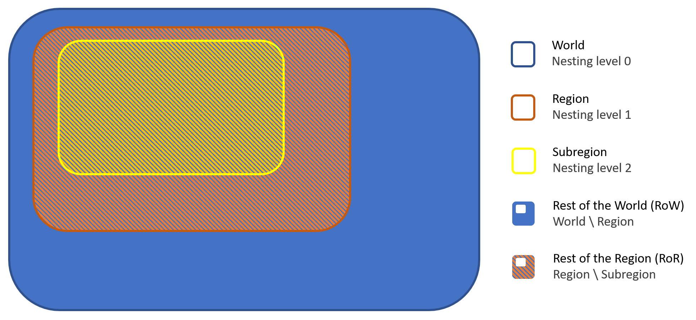

# General logic of the pymedeas models

The MEDEAS models dynamically operate as follows: for each
period, a sectoral economic demand is estimated from exogenous
pathways of expected Gross Domestic Product per capita  (GDPpc) and population evolution. The final energy demand required to fulfil production is obtained using energy-economy hybrid input-output analysis, and energy intensities by type of final energy. The energy sub-module computes the available final energy supply, which may or may not satisfy demand, adapting the economic production to the available energy. The materials required by the economy, with emphasis on those
required by alternative green technologies, are estimated; this allows to
assess eventual future mineral bottlenecks. The new energy infrastructure requires energy investments, whose computation allows to estimate
the variation of the EROI (Energy Return over Energy Invested) of the
system, which in turn affects the final energy demand. The climate sub-
module computes the greenhouse gas (GHG) emissions associated to the
resulting energy mix (complemented by exogenous pathways for non-energy emissions), which feeds back to the economy, affecting final
demand. Additional land requirements are accounted for. Finally, the
social and environmental impacts are computed. For more detail the
reader is referred to Refs. --> **all this is taken from [@SAMSO2020100582] and needs to be either cited or modified**

# Main hypothesis behind the pymedeas models
blah blah blah


# Main features of the pymedeas models

## Nestings

```diff
- Need to add nesting information here as it is required when explaining some modules.
```

---
TODOs
- [x] Include main explanation about nexting
- [ ] Add runing nested models information
- [x] Add informations about rest of the "region" (RoW, RoR...).
- [x] Include a figure

The pymedeas models allow to running from world experiments to small scale regions. In order to do so, three pymedeas models are provided, which are organized in two nestings:
- The main model is the full world model (nesting level 0). This model repressents the full agreggated world system.
- The first nested model (nesting level 1) corresponds to a regional model, this model repressents a region of the world model.
- The second nested model (nesting level 2) corresponds to a subregional model, this model repressents a subregion of the region used in the regional model

In the nested models we commonly refer to the complementary part of the region as rest of the world (RoW) or rest of the region (RoR). Therefore, Row repressents all the world except Region, and RoR repressents all the Region except Subregion, see the figure below.


In order to run a nested model the upper... bla bla bla

# Modules
The pymedeas models are structured in seven modules: 

## Energy
This module is in charge of the estimation of energy demand, the energy supply, the energy resource availability, the modelling of electricity and heat generation and the modelling of non-energy use. The module is diveded in 6 submodules:

- Availability
- Supply
- Demand
- Consumption
- Storage
- EROI

#### Availabiliy
---
TODOs
- [ ] Oil extraction, reformulate in only one way
- [ ] Gas extraction, reformulate in only one way
- [ ] Explain year scarcity

---

This submodule calculates the availability of non-renewable energy sources: oil, natural gas, coal and uranium.

**Oil Extraction**

This view takes into account the limitation of the oil resources, and models availability of oil depending on two constraints: the stock (EJ) and the flows (Watts). The model priorizes the others NRE liquids fuels, then the oil demand is obtained as follows:

```math
\begin{equation}
Oil_{demand}=PED_{NRE\_Liquids}-FES_{CTL}- FES_{GTL}- ORF
\end{equation}
```

Where PED_NRE_Liquieds is the Primary energy demand of non-renewable eneregy liquids (EJ), FES_GTL is the final energy demand of GTL (Gas-to-liquids) (EJ),  FES_CTL is the final energy demand of GTL (Coal-to-liquids) (EJ) and ORF is the oil refinery gains.

**Coal extraction**

This view is in charge of obtaining the coal extraction taking into account the limitations of the coal resources. The model priorizes other solid NRE sources for satisfying the primary energy demand.

```math
\begin{equation}
Coal_{demand}=PED_{solids}-PE_{trad\_bio}-PES_{peat}-PES_{waste}-LCP
\end{equation}
```

Where, PED_solids is the primary energy demand of the solids (EJ), PE_trad_bio is the primary energy of the traditional biomass (EJ), PES_peat is the Primary energy suplly of peat (EJ), PES_waste is the primary energy obtained from waste (EJ) and LCP are the losses in charcoal plants (EJ).

The amount of coal that can be extracted is limited by the Hubbert curves if the parameters *unlimited coal?* and *unlimited NRE?* are desactivated. Then, the extraction of coal is limited by the maximum extraction limit as:

```math
\begin{equation}
Coal_{extraction}=min(PED_{coal}, max\_extract\_coal))
\end{equation}
```

**Uranium extraction**

This view is in charge of calculating the uranium extraction, taking into account the Hubbert curve of maxim extraction of the uranium. The demand of uranium is obtained from the potential generation of nuclear electricity divided by the efficiency of uranium for electricity. If the parameters *unlimited uranium?* and *unlimited NRE?* are desactivated, the extraction of uranium is limited by the maximum extraction limit as:

```math
\begin{equation}
Uranium_{extraction}=min(PED_{uranium}, max\_extract\_uranium))
\end{equation}
```

In the nested models, for calculating the abundance of uranium, the imports from the rest of the world are included. In such way, when there is local scarcity, the imports can compensate it.

```diff
- There can be a double counting of imports of the RoW of the nested model of Europe and the nested model of Catalonia!
```

**Final energy abundance**

The abundance of final fuels is obtained from the primary energy demand (PED) and the primary energy supply (PES) as follows:

```math
\begin{equation}
A= {{PED_i-PES_i} \over {PED_i}}
\end{equation}
```

When the PED\<\PES the abundance is always 1. The index i is the energy carrier: liquids, gases, solids, electricity and heat.
Then, depending on the *sensitivity_to_scarcity_option* defined in the scenarios files, the perception of final energy scarcity of each fuel by economic sectors is obtained. This perception drives the fuel replacement and efficiency improvement. This perception of scarcity decreases on time depending on the *energy_scarcity_forgeting_time* defined also at the scenario files as the time in years that society takes to forget the percepticon of scarcity for economic sectors.

#### Supply

Primary total energy demand is covered with different Primary Energy Sources (PES) gruped in five categories: solids, liquids, gases, electricity and heat

**Nuclear**

Installation of nuclear plants is limited by several factors: uranium availability, RES supply, nuclear Cp. The uranium scarcity that is calculated in the availabilty submodule, 

There are four different scenarios

1. Constant power at current levels
2. No more nuclear power installed capacity
3. Growth of nuclear power installed capacity
4. Phase-out nuclear power

In the firts one, the nuclear capacity is being substitute when the lifetime of the installations is reached; in the second scenario, there is not more nuclear power installed when the facilities are depreciated; in the third scenario there is a yearly increase of the power capacity; and in the phase-out scenario there is a decrease of nuclear facilities before its lifetime is reached. 

The new annual increase of new planned nuclear capacity is zero except for the scenario 3, where this increase of capacity is defined in the scenario's excel. Then, the new requiered capacity is obtained by:

```math
\begin{equation}
C_{new \_nuc}=   C_{nuc} \cdot G_{nuc\_elect} \cdot S_{uranium} \cdot Cp_{limit}
\end{equation}
```

Where C_num is the actual installed capacity, G_nuc_elect is the annual growth of new planned nuclear capacity, S_uraium is the uranium scarcity and Cp limit is a factor that limitates the new capacity installation when the capacity factor of nuclear due to the RES penetration falls below 60%.

**RES electricity potentials**

#### Demand

#### Consumption

#### Storage

#### EROI

### Economy
---
TODOs
- [x] Document final demand computation process
- [ ] Document real demand computation process (economy evolution)
- [ ] Include final energy intensities in this section
- [ ] Add information about the module inputs
- [x] Add information about the scenario parameters
---

---
**inputs** *economy.xlsx*
- Capital compensation per sector
- Labour compensation per sector
- Gross fixed capital formation per sector
- Household demand per sector
- Goverment expenditures per sector
- Change in inventories per sector
- Final demand by sector of other regions per sector[^regionaldata]
- Export of final goods to other regions per sector[^regionaldata]
- Gross Domestic Product (GDP)
- Economic coefficient A matrix for the wanted sectors[^coeffmatrix]

[^regionaldata]: This variables are only required in the nested models, and are the export from the running region to the rest of the parent regions.
[^coeffmatrix]: Coefficient matrix should be given in the dessagregation of the current level, if the input is for a subregion, the first submatrix should be for the subregion the second for the rest of the region and the last for the rest of the world.

**scenario parameters**
- GDPpc growth
- LC and CC growth policies...
- #TODO complete


---

```diff
- where do we include energy intensities?
```

#### Final demand

The final demand ($FD$) is the basis of the economic evolution of pymdedeas models. For the computation of the final demand the expected $GDP$ evolution is used.

**Capital and labour compensations**

```diff
This process is split in different submodules:
- pymedeas_w: sectors_and_households
- pymedeas_eu: gdp_desired_labour_and_capital_share
- pymedeas_cat: gdp_desired_labour_and_capital_share
```

Capital compensation ($CC$) and labour compensation ($LC$) are used in the models to compute the time evolution of final demands. This values are computed from a share of the gross domestic product ($GDP$).

Both capital and labour compensations are computed in a similar ways. First the expected $GDP$ of next step (time $i\!+\!1$) is computed, as:

```math
\begin{equation}
GDP_{expected}^{i+1} = GDP^i\,(1+GDPgrowth^{i}_{expected})
\end{equation}
```

the value of $GDPgrowth^{i}_{expected}$ is setted in the scenario file by the user.

Then the expected capital compensation share ($CCshare$) and labour compensations share ($LCshare$) respect to the $GDP$ are computed as:

```math
\begin{gather}
LCshare_{expected}^{i+1} = LCshare^i\,(1+LCgrowth_{expected})\\
CCshare_{expected}^{i+1} = CCshare^i\,(1+CCgrowth_{expected})
\end{gather}
```

Therefore, the expected $LC$ and $CC$ can be easily computed as:

```math
\begin{gather}
LC_{expected}^{i+1} = GDP_{expected}^{i+1} \, LCshare_{expected}^{i+1}\\
CC_{expected}^{i+1} = GDP_{expected}^{i+1} \, CCshare_{expected}^{i+1}
\end{gather}
```

Therefore, the expected variation of $LC$ and $CC$ can be computed as follows:

```math
\begin{gather}
\Delta LC_{expected}^i = GDP^i\,LCshare^i\,\Big[\left(1+GDPgrowth^{i}_{expected}\right)\,\left(1+LCgrowth_{expected}\right)-1\Big]\\
\Delta CC_{expected}^i = GDP^i\,CCshare^i\,\Big[\left(1+GDPgrowth^{i}_{expected}\right)\,\left(1+CCgrowth_{expected}\right)-1\Big]
\end{gather}
```

Finally the new step $LC$ and $CC$ are corrected using the total uncovered demand ($UD_{total}$) of the current step:

```math
\begin{gather}
LC^{i+1} = LC^i+\Delta LC_{expected}^i-UD_{total}^i\,LCshare_{expected}^i\\
CC^{i+1} = CC^i+\Delta CC_{expected}^i-UD_{total}^i\,CCshare_{expected}^i
\end{gather}
```

```diff
- Current version of pymedeas_cat doesn't take into account the uncovered demand to compute the CC and LC!
- In the world model the CC is computed by sectors CC(sector), maybe we should compute the total directly in order to have the same approach in the 3 models.
```

**Gross fixed capital formation and households demand**

```diff
This process is split in different submodules:
- pymedeas_w: sectors_and_households
- pymedeas_eu: households_economic_demand / exports_demand
- pymedeas_cat: households_economic_demand_and_investment
```

The gross fixed capital formation ($GFCF$) and households demand ($HD$) by sector at time $i$ are computed asuming the following relations.

```math
\begin{gather}
\log\left(GFCF^i(sector)\right) = b_0^{GFCF}(sector) + b_1^{GFCF}\,\log\left(CC^i\right)\\
\log\left(HD^i(sector)\right) = b_0^{HD}(sector) + b_1^{HD}\,\log\left(LC^i\right)
\end{gather}
```

where $b_x^y$ parameters are adjusted by doing a linear regression with historical data. Being $CC$ and $LC$ the capital and labour compensations respectively.

Therefore, the expected variation in both variables is computed as follows:
```math
\begin{gather}
\Delta GFCF^i_{expected}(sector) = e^{b_0^{GFCF}(sector)}\,\Big[\left(CC^i\!+\!\Delta CC_{expected}^i\right)^{b_1^{GFCF}}-\left(CC^{i}\right)^{b_1^{GFCF}}\Big]\\
\Delta HD^i_{expected}(sector) = e^{b_0^{HD}(sector)}\,\Big[\left(LC^i\!+\!\Delta LC_{expected}^i\right)^{b_1^{HD}}-\left(LC^{i}\right)^{b_1^{HD}}\Big]
\end{gather}
```

Finally the new step $GFCF$ and $HD$ are corrected using the uncovered demand by sector ($UD$) of the current step:

```math
\begin{align}
GFCF^{i+1}(sector) =\hspace{5pt}  &GFCF^i(sector)+\Delta GFCF^i_{expected}(sector)\nonumber\\
                     &-UD^i(sector)\,GFCFshare^i_{expected}(sector)\\
HD^{i+1}(sector) =\hspace{5pt}  &HD^i(sector)+\Delta HD^i_{expected}(sector)\nonumber\\
                   &-UD^i(sector)\,HDshare^i_{expected}(sector)
\end{align}
```

```diff
- In the world model the CC is used by sectors.
```

**Exports demand**
The exports demand is only computed in nested models. In the case of the regional model, the exports to the *rest of the world (RoW)* are needed, while, in the case of the subregional model the exports to the *rest of the region* (RoR) and *rest of the world* (RoW) are needed.

The computation of the exports demand ($ExpD$) is similar to that used for gross fixed capital formation and households demand:

```math
\begin{equation}
\log\left(ExpD^i_{ExpRoX}(sector)\right) = b_0^{ExpRoX}(sector) + b_1^{ExpRoX}\,\log\left(GDP^i_X\right)
\end{equation}
```

where $b_x^y$ parameters are adjusted by doing a linear regression with historical data. Being $GDP_X$ the gross domestic product of X (world or region).

Therefore, the expected variation is computed as follows:

```math
\begin{equation}
\Delta ExpD^i_{RoX,\,expected}(sector) = e^{b_0^{ExpRoX}(sector)}\,\Big[\left(GDP^{i+1}_X\right)^{b_1^{ExpRoX}}-\left(GDP^i_X\right)^{b_1^{ExpRoX}}\Big]
\end{equation}
```

Finally the new step $GFCF$ and $HD$ are corrected using the uncovered demand by sector ($UD$) of the current step:

```math
\begin{align}
ExpD^{i+1}_{RoX}(sector) = \hspace{5pt}&ExpD^i_{RoX}(sector)+\Delta ExpD^i_{RoX,\,expected}(sector)\nonumber\\
&-UD^i(sector)\,ExpD_{RoX}share^i_{expected}(sector)
\end{align}
```


**Change in inventories and goverment expenditures**

```diff
This process is split in different submodules:
- pymedeas_w: sectors_and_households
- pymedeas_eu: economic_demand
- pymedeas_cat: economic_demand
```

The share of change in inventoris and goverment expenditures ($CI\&GEshare$) respect to the final demand is assumed constant after the historic period. This way the goverment expenditures and change in inventories contribution to the finall demand ($CI\&GE$) by sector at time $i$ is computed in the following way:

```math
\begin{align}
CI\&GE^i(sector)=\frac{CI\&GEshare}{1-CI\&GEshare}\,\Big[&GFCF^i(sector)+HD^i(sector)\nonumber \\&+ExpD^i(sector)\Big]
\end{align}
```

where $GFCF$, $HD$ and $ExpD$ are the gross fixed capital formation, the household demand and the exports demand by secotor.


**Final demand**

```diff
This process is split in different submodules:
- pymedeas_w: sectors_and_households
- pymedeas_eu: economic_demand
- pymedeas_cat: economic_demand
```

The final demand $FD$ is the sum of gross fixed capital formation ($GFCF$), households demand ($HD$), change in inventories and goverment expenditures ($CI\&GE$) and exports demand $ExpD$ (if we are not running world model). Therefore, the $FD$ by sector at time $i$ can be computed as:

```math
\begin{equation}
FD^i(sector) = GFCF^i(sector)+HD^i(sector)+ExpD^i(sector)+CI\&GE^i(sector)
\end{equation}
```

and if we use the expression from the previous section we have:

```math
\begin{equation}
FD^i(sector)=\frac{GFCF^i(sector)+HD^i(sector)+ExpD^i(sector)}{1-CI\&GEshare}
\end{equation}
```

Therefore, the expected change in the final demand is computed using the expected change of all the variables that are in the previous equation:

```math
\begin{align}
\Delta FD_{expected}^i&(sector)=\nonumber\\
&\frac{\Delta GFCF_{expected}^i(sector)+\Delta HD_{expected}^i(sector)+\Delta ExpD_{expected}^i(sector)}{1-CI\&GEshare}
\end{align}
```

The evolution of final demand by sector to the next step is computed considering the uncovered demand in the current step:

```math
\begin{equation}
FD^{i+1}(sector)=FD^i(sector)+\Delta FD_{expected}^i(sector)-UD^i(sector)
\end{equation}
```


#### Economy evolution

**Total outputs from demand**


**Coefficient matrices**


### Climate
This module does.....
### Environment
This module does.....
### Materials
This module does.....
### Society
This module does.....

**Population**

This view calculates the evolution of the population from exogenous drivers. There are three different ways to obtain the population evolution: From SSPs, from timeseries introduced manually or from annual constant variation. In this way, the population growth follows an independent evolution from other variables.

```diff
- The population submodule has to be revised introducing some limitation on the population growth, that can depend on the GDP, the damage function, etc.
```
**Social and environmental impacts**

This view relates the biophysicals results with social and environmental indexes. There is a need of indetifying factors that influence social welfare by covering more aspects than only income levels. Thios social welfare indicators are influenced byeconomic variables such as population and GDP, but also connected to climate module.

The first calculated index is the Human Development Index. It has been observed that above certain level of GDP, the HDI decouples from income. Therefore it is important to consider other relations that may explain the HDI evolution. Among these, energy consumption is found to have an importnat relation, so it is used by the model, following the next equation:

```math
HDI=0.1508+0.1395 \cdot ln(TFEC_{pc})
```

```diff
- The correlation of the HDI with the TFEC is not the best approax, it can be approximated by the relation with the Final Energy Footprint per capita (FEFpc) (Deliverable 4.1)
```
Then the carbon footprint per capita and the water use per capita are calculated dividing the total ammounts by the population. Finally, the CO2 emissions per value added is obtained dividing the total CO2 emissions by the GDP.

### Transport
This module does.....

